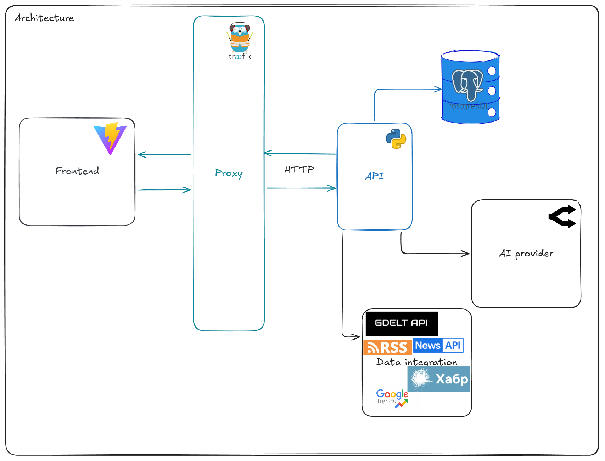
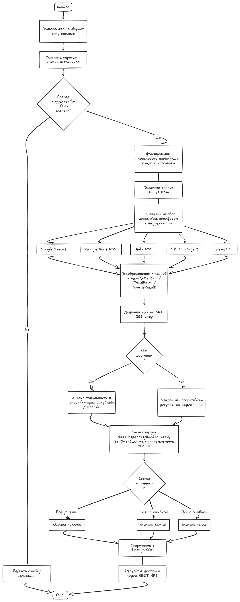
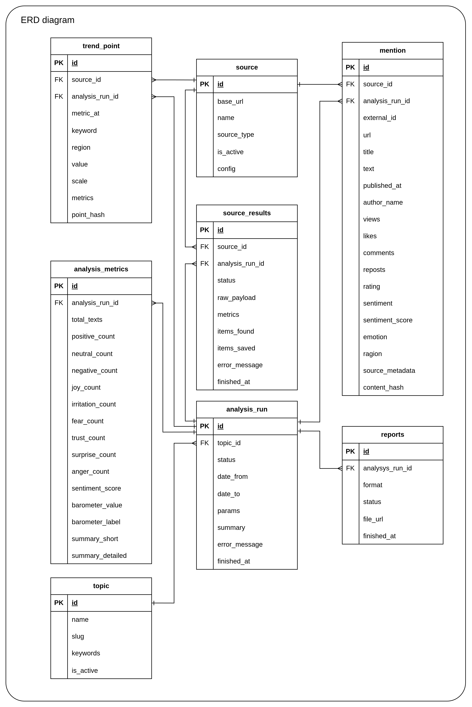

{width=128 height=128}

# Digital Barometer

### Media monitoring with an LLM sentiment barometer

We collect mentions of a topic across the web, rate their sentiment and emotions,
and turn them into trends and reports.

---

## How it works

| 🔎 Collects | 🧠 Rates | 📈 Aggregates | 📊 Shows |
| :---: | :---: | :---: | :---: |
| GDELT, NewsAPI, RSS feeds and Google Trends are queried in parallel for a topic and period | An LLM rates the sentiment and emotion of every mention; a keyword heuristic takes over if it is unavailable | Mentions roll up into a 0–100 barometer index, emotion distribution and short insights | The dashboard shows the gauge, charts, trends and the mentions themselves |

 
Backend layers: <code>api → services → repositories → db</code>; models and migrations in a separate <code>digital-barometer-db</code> package

## Repositories

<table>
<tr><th colspan="2">🖥 Product</th></tr>
<tr>
<td width="48" align="center">🧠</td>
<td><a href="https://github.com/digital-barometer/backend"><b>backend</b></a> — REST API, data collection, LLM sentiment and emotion analysis Python · FastAPI · dishka · SQLAlchemy · Alembic · PostgreSQL · LangChain</td>
</tr>
<tr>
<td align="center">📊</td>
<td><a href="https://github.com/digital-barometer/frontend"><b>frontend</b></a> — dashboard: topics, sources, barometer and analysis charts React 18 · TypeScript · Vite · Tailwind CSS · Recharts</td>
</tr>
<tr><th colspan="2">🏗️ Platform</th></tr>
<tr>
<td align="center">🛠️</td>
<td><a href="https://github.com/digital-barometer/infra"><b>infra</b></a> — Traefik reverse proxy with automatic TLS and the shared PostgreSQL Traefik · Let's Encrypt · PostgreSQL 16 · Docker Compose</td>
</tr>
</table>

## Analysis flow

Sources are queried in parallel, results are normalized to a common model (`Mention` / `TrendPoint` /
`SourceResult`) and deduplicated by a SHA-256 content hash. Each source is tracked separately, so a run ends
as `success`, `partial` or `failed` depending on which sources worked. API keys and `Authorization` headers
are stripped from error messages before they are stored.

## Getting started

| I want to… | Go to |
| --- | --- |
| **deploy it** | [infra](https://github.com/digital-barometer/infra#quick-start) → [backend](https://github.com/digital-barometer/backend#quick-start) → [frontend](https://github.com/digital-barometer/frontend#quick-start) |
| **integrate over REST** | [backend contracts](https://github.com/digital-barometer/backend#contracts) — Swagger at `/docs` |
| **add a data source** | [backend features](https://github.com/digital-barometer/backend#features) — connectors and `ConnectorFactory` |

## Data model

| Table | Purpose |
| --- | --- |
| `topics` | tracked topics and their keywords |
| `sources` | configured data sources (GDELT, NewsAPI, RSS, Trends) |
| `analysis_runs` | one analysis of a topic over a period |
| `source_results` | per-source result within a run: status, item counts, metrics |
| `mentions` | collected mentions with sentiment and emotion |
| `trend_points` | time series from sources, e.g. Google Trends values |
| `analysis_metrics` | aggregated sentiment and emotion figures and the barometer index |
| `reports` | generated report files for a run |
